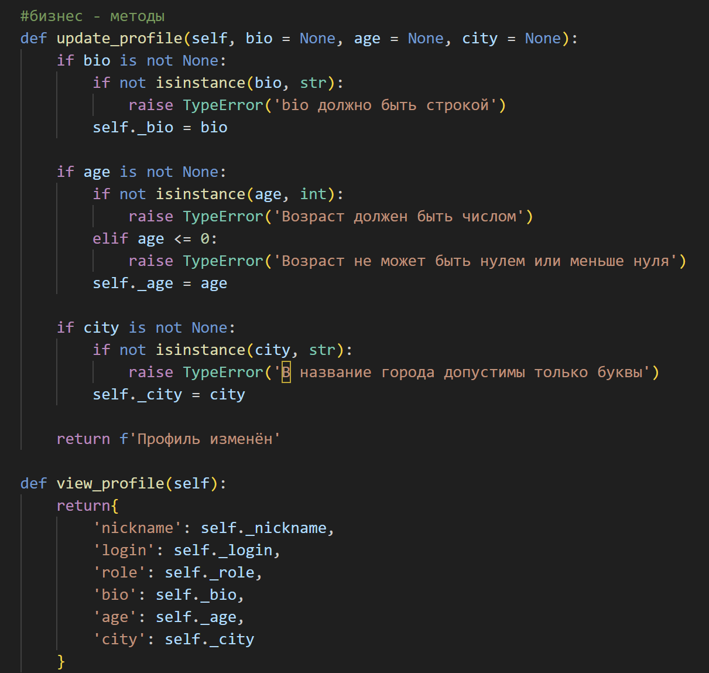
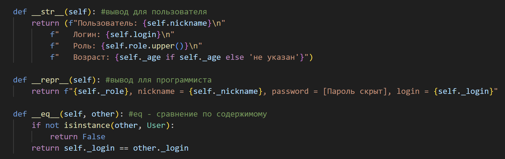

# Лабораторная работа #1, вариант 8
## 1.CLass User
### атрибут класса и закрытые экземпляры


## 2.Декоратор @Property с валидацией и метод - setter
 
 

## 3.Бизнес - методы
- Обновление профиля
- Просмотр профиля
 

## 4.Магические методы 
### ```__str__``` - неформальное строковое представление объекта для пользователей (например, для print())
### ```__repr__``` - официальное строковое представление для разработчиков (отладочная инфомрация)
### ```__eq__``` - переопределяет оператор равенства ```==```, задает логику сравнения объектов



